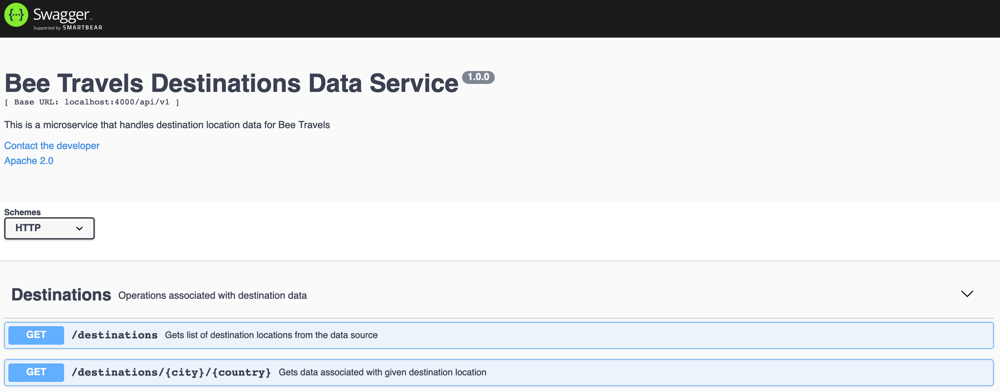

# Bee Travels Destination Service - Node.js

The destination service is a microservice designed to provide information about various destination locations for the Bee Travels travel application.

## Data

The destination cities used are a subset of cities with a population over 1 million people and consists of the following data for various destination locations around the world:

* City name
* Latitude
* Longitude
* Country
* Population
* Description about the city
* Images of the city

## APIs



## How to Run

* [Local with no containers](#local-with-no-containers)
* [Local with containers](#local-with-containers)
* [Deploy to the Cloud](#deploy-to-the-cloud)

### Local with no containers

#### Prerequisites

* [NodeJS v10+](https://nodejs.org/en/download/)
* [NPM](https://www.npmjs.com/get-npm)

#### Steps

```bash
git clone https://github.com/bee-travels/bee-travels-node
cd src/destination
npm install
npm start
```

In a browser, go to `localhost:9001` to interact with the destination service APIs in the swagger.

### Local with containers

#### Prerequisites

* [Docker for Desktop](https://www.docker.com/products/docker-desktop)

#### Steps

```bash
git clone https://github.com/bee-travels/bee-travels-node
cd src/destination
docker build -t beetravels-node-destination .
docker run -it beetravels-node-destination
```

In a browser, go to `localhost:9001` to interact with the destination service APIs in the swagger.

### Deploy to the Cloud

Bee Travels currently supports deploying to the Cloud using the following configurations:

* Helm
* K8s
* Knative

For instructions on how to deploy the destination service to the Cloud, check out the [config](https://github.com/bee-travels/config) repo for the Bee Travels project.

## How to Test

### Local with no containers

Run `npm test` from the `/src/destination` directory. If all goes well, there should be 2 passing tests.
